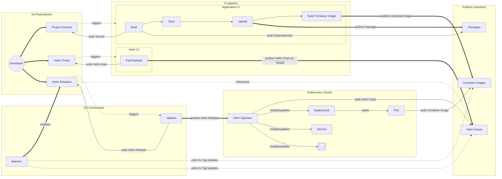

# GitOps with Kubernetes in a Nutshell

```mermaid
flowchart LR
  dev(("Developer"))
  subgraph SCM ["Git Repositories"]
    direction LR
    dev ==> appsrc[Project Sources] & charts[Helm Charts] & hr[Helm Releases]
  end
  subgraph CI ["CI pipeline"]
    direction LR
    subgraph appci ["Application CI"]
      direction LR
      Build --> Tests
      Build -->|pulls Source| appsrc
      Tests --> Upload
      Upload --> image[Build Container Image]
    end
    appsrc -.->|triggers| appci
    subgraph helmci ["Helm CI"]
       pack["Pack/Upload"] -->|pulls Helm chart| charts
    end
    charts -.->|triggers| helmci
  end
  subgraph CD ["CD Orchestrator"]
    direction TB
    Watcher ==>|updates| hr
    hr -..-> |triggers| Updater 
    Updater -->|pulls Helm Release| hr
  end
  subgraph ART ["Artifacts repository"]
    direction TB
    Build -->|pulls Dependencies| packagesrepo[Packages]
    Upload ==>|pushes Package| packagesrepo
    image ==>|pushes Container Image| containerrepo[Container Images]
    Watcher -.->|polls for Tag Updates| containerrepo & helmrepo[Helm Charts]
    pack ==>|pushes Helm Chart as Tarball| helmrepo
    hr -.->|references| helmrepo
  end
  subgraph KUBE ["Kubernetes Cluster"]
    direction LR
    Updater ==>|pushes Helm Release| helmop["Helm Operator"]
    helmop -->|pulls Helm Chart| helmrepo
    helmop -->|installs/updates| Deployment & Service & other[[...]]
    Deployment -->|starts| Pod -->|pulls Container Image| containerrepo
  end
```
