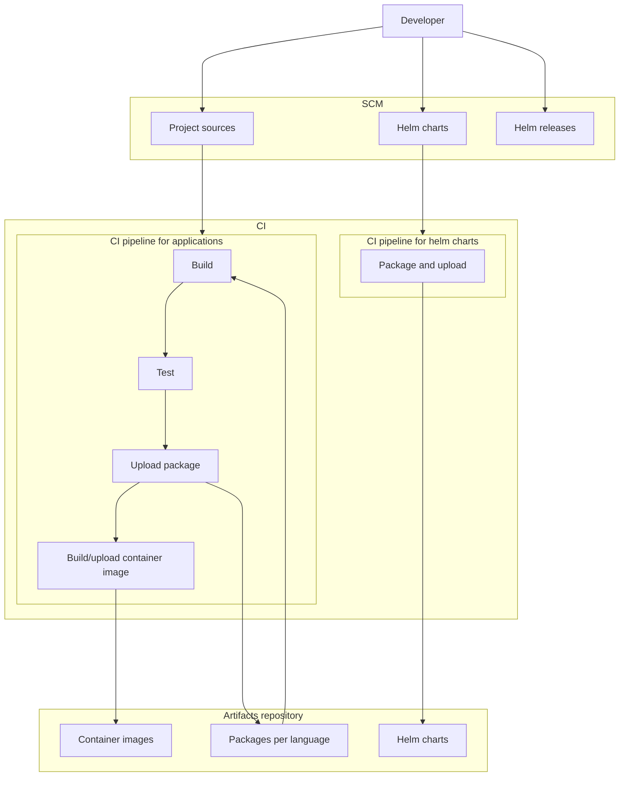

# CI/CD

```mermaid
flowchart TB
  subgraph SCM
    direction TB
    prj[Project sources]
    iac[Helm charts]
    hr[Helm releases]
  end
  subgraph CI
    direction TB
    subgraph appci ["CI pipeline for applications"]
      direction LR
      build[Build] ---> test[Test]
      test ---> upload["Upload package"]
      upload ---> image["Build/upload container image"]
    end
    subgraph helmci ["CI pipeline for helm charts"]
       pack["Package and upload"]
    end
  end
  subgraph ART ["Artifacts repository"]
    direction TB
    packagesrepo["Packages per language"]
    containerrepo["Container images"]
    helmrepo["Helm charts"]
  end
  
  dev["Developer"] ---> prj
  dev ---> iac
  dev ---> hr
  prj ---> appci
  upload ----> packagesrepo
  packagesrepo ----> build
  image ----> containerrepo
  iac ---> helmci
  pack ----> helmrepo

```
