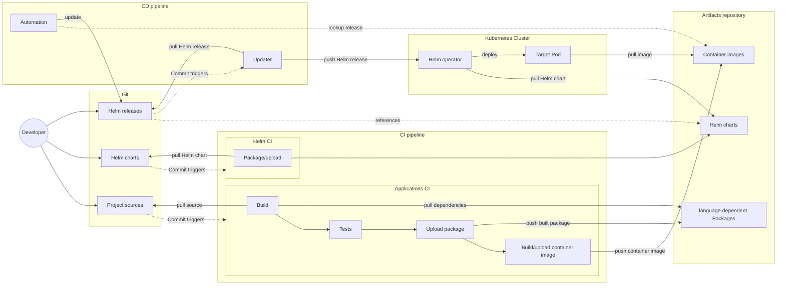

# GitOps

```mermaid
flowchart LR
  dev(("Developer"))
  subgraph SCM ["Git"]
    direction TB
    prj[Project sources]
    iac[Helm charts]
    hr[Helm releases]
  end
  dev --> prj
  dev --> iac
  dev --> hr
  subgraph CI ["CI pipeline"]
    direction TB
    subgraph appci ["Applications CI"]
      direction LR
      build[Build] --> test[Tests]
      test --> upload["Upload package"]
      upload --> image["Build/upload container image"]
    end
    prj -.->|Commit triggers| appci
    subgraph helmci ["Helm CI"]
       pack["Package/upload"]
    end
  end
  iac -.->|Commit triggers| helmci
  subgraph ART ["Artifacts repository"]
    direction TB
    packagesrepo["language-dependent Packages"]
    containerrepo["Container images"]
    helmrepo["Helm charts"]
  end
  subgraph ART ["Artifacts repository"]
    direction TB
    packagesrepo["language-dependent Packages"]
    containerrepo["Container images"]
    helmrepo["Helm charts"]
  end
  upload -->|push built package| packagesrepo
  build -->|pull source| prj
  build -->|pull dependencies| packagesrepo
  image -->|push container image| containerrepo
  pack -->|pull Helm chart| iac
  pack --> helmrepo
  hr -.->|references| helmrepo
  subgraph CD ["CD pipeline"]
    direction LR
    orchauto["Automation"] -.->|lookup release| containerrepo
    orchauto -->|update| hr
    orchupdate["Updater"] -->|pull Helm release| hr
  end
  hr -.-> |Commit triggers| orchupdate
  subgraph cluster ["Kubernetes Cluster"]
    direction TB
    orchupdate -->|push Helm release| helmop["Helm operator"]
    helmop -->|pull Helm chart| helmrepo
    helmop -->|deploy| pod["Target Pod"]
    pod -->|pull image| containerrepo
  end

```
