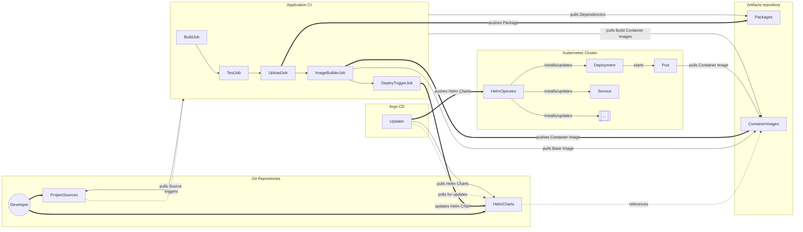

# GitOps with Kubernetes and Argo CD

```mermaid
flowchart LR

  subgraph SCM ["Git Repositories"]
    direction TB
    Developer((Developer)) ==> ProjectSources & HelmCharts
  end

  subgraph appci ["Application CI"]
    direction LR
    BuildJob --> TestJob
    TestJob --> UploadJob
    UploadJob --> ImageBuilderJob
    ImageBuilderJob --> DeployTriggerJob
  end

  subgraph CD ["Argo CD"]
    direction TB
    Updater
  end

  subgraph ART ["Artifacts repository"]
    direction TB
    Packages
    ContainerImages
  end

  subgraph KUBE ["Kubernetes Cluster"]
    direction LR
    HelmOperator -->|installs/updates| Deployment & Service & other[[...]]
    Deployment -->|starts| Pod
  end

  ProjectSources -.....->|triggers| appci
  HelmCharts -...->|references| ContainerImages

  appci ------>|pulls Source| ProjectSources
  appci ---->|pulls Dependencies| Packages
  appci ---->|pulls Build Container Images| ContainerImages
  UploadJob ====>|pushes Package| Packages
  ImageBuilderJob ---->|pulls Base Image| ContainerImages
  ImageBuilderJob ====>|pushes Container Image| ContainerImages
  DeployTriggerJob ==>|updates Helm Chart| HelmCharts

  Updater -.->|polls for updates| HelmCharts 
  Updater -->|pulls Helm Charts| HelmCharts
  Updater ==>|pushes Helm Charts| HelmOperator

  Pod -->|pulls Container Image| ContainerImages

```
