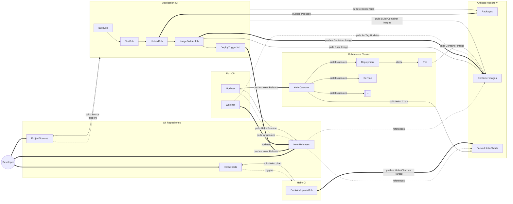

# GitOps with Kubernetes and Flux

```mermaid
flowchart LR

  Developer((Developer))

  subgraph SCM ["Git Repositories"]
    direction TB
    ProjectSources & HelmCharts & HelmReleases
  end

  subgraph appci ["Application CI"]
    direction LR
    BuildJob --> TestJob
    TestJob --> UploadJob
    UploadJob --> ImageBuilderJob
    ImageBuilderJob --> DeployTriggerJob
  end

  subgraph helmci ["Helm CI"]
    PackAndUploadJob
  end

  subgraph CD ["Flux CD"]
    direction TB
    Watcher & Updater
  end

  subgraph ART ["Artifacts repository"]
    direction TB
    Packages
    ContainerImages
    PackedHelmCharts
  end

  subgraph KUBE ["Kubernetes Cluster"]
    direction LR
    HelmOperator -->|pulls Helm Chart| PackedHelmCharts
    HelmOperator -->|installs/updates| Deployment & Service & other[[...]]
    Deployment -->|starts| Pod
  end

  Developer ==> ProjectSources & HelmCharts & HelmReleases
  
  ProjectSources -...->|triggers| appci
  HelmCharts -.->|triggers| helmci
  HelmReleases -...->|references| ContainerImages & PackedHelmCharts
  
  appci ---->|pulls Source| ProjectSources
  appci ---->|pulls Dependencies| Packages
  appci ---->|pulls Build Container Images| ContainerImages
  UploadJob ====>|pushes Package| Packages
  ImageBuilderJob ---->|pulls Base Image| ContainerImages
  ImageBuilderJob ====>|pushes Container Image| ContainerImages
  DeployTriggerJob ==>|pushes Helm Release| HelmReleases

  helmci -->|pulls Helm chart| HelmCharts
  PackAndUploadJob ====>|pushes Helm Chart as Tarball| PackedHelmCharts
 
  Watcher -..->|polls for Tag Updates| ContainerImages
  Watcher ==>|updates| HelmReleases
  Updater -.->|polls for updates| HelmReleases 
  Updater -->|pulls Helm Release| HelmReleases
  Updater ==>|pushes Helm Release| HelmOperator
  
  Pod -->|pulls Container Image| ContainerImages

```
